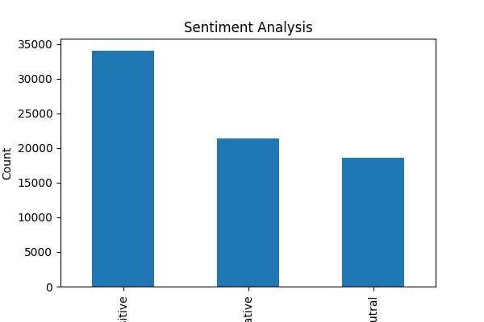

# 😊 Sentiment Analysis on Social Media Data (Task-04)


---

## 📌 Project Overview
This project focuses on analyzing and visualizing sentiment patterns in social media data to understand public opinion and attitudes toward different topics or brands.

Using Natural Language Processing (NLP), the text data is classified into:
- Positive 😊
- Negative 😡
- Neutral 😐

---

## 🚀 Key Features
- Text preprocessing and cleaning
- Sentiment classification using TextBlob
- Automatic polarity detection
- Visualization of sentiment distribution
- Easy-to-understand graphical output

---

## 📊 Dataset
- Social Media Dataset (Twitter Data)
- Contains text-based user opinions and topics

---

## 🛠️ Tech Stack
- **Language:** Python
- **Libraries:**  
  - Pandas  
  - Matplotlib  
  - Seaborn  
  - TextBlob  

---

## ⚙️ Installation & Usage

### 1️⃣ Install dependencies
```bash
pip install pandas matplotlib seaborn textblob
```

### 2️⃣ Run the project
```bash
python task4.py
```

---

## 📈 Output

### 🔹 Sentiment Distribution Chart


---

## 🎯 Result
- Successfully classified text into Positive, Negative, and Neutral sentiments  
- Generated a clear visualization of sentiment distribution  
- Gained insights into public opinion patterns  

---

## 💡 Conclusion
Sentiment Analysis helps in understanding user opinions and can be widely used in:
- Business decision making
- Brand monitoring
- Social media analysis

---

## 🔗 Internship Details
This project is part of the **Data Science Internship at Prodigy InfoTech**

---

⭐ If you like this project, feel free to star the repository!
